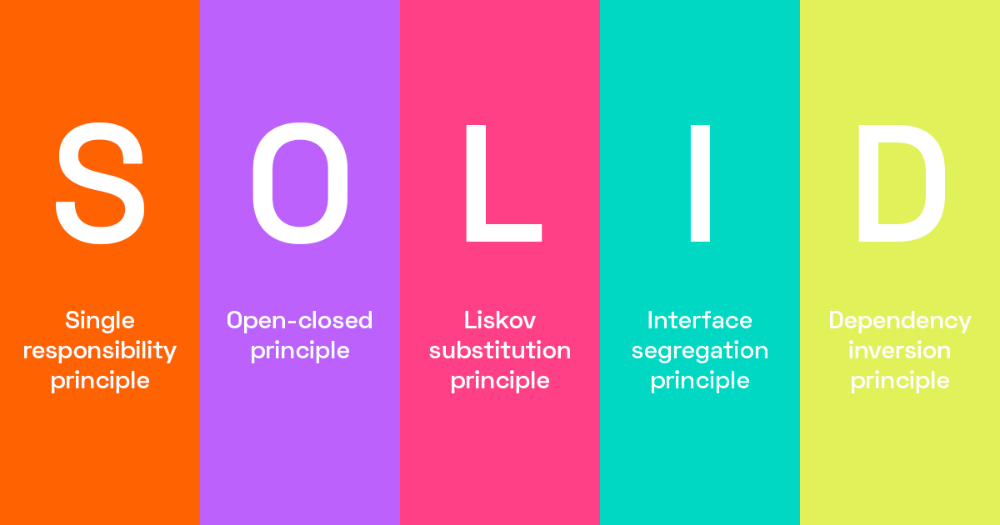

# 🚀 SOLID + Clean Architecture: Projeto completo com NodeJS, Typescript, Express e Prisma



## 🏗️ Visão Geral do Projeto

Este projeto foi desenvolvido utilizando os princípios da **Clean Architecture**, um padrão que promove a separação de responsabilidades e facilita a manutenção, testes e escalabilidade do código. O projeto foi implementado em **Node.js** com **Typescript** e utiliza **Express** para o desenvolvimento da API, além de **Prisma** como ORM para interação com o banco de dados.

O objetivo principal deste projeto é exemplificar como a **Clean Architecture** pode ser aplicada na prática, organizando o código em camadas bem definidas, com responsabilidades claras e com foco na independência de frameworks, bibliotecas e interfaces externas.

### 🔍 Estrutura do Projeto

A estrutura do projeto é organizada da seguinte maneira:

- **Domain**: Contém as entidades centrais do domínio da aplicação. Neste projeto, por exemplo, a entidade `Product` está presente, representando os dados e as regras de negócio relativas a produtos.
  
- **Gateway**: Define as interfaces que ligam o domínio à infraestrutura externa, como o repositório de dados.
  
- **Infra**: A camada de infraestrutura lida com os detalhes de implementação, como as interações com o banco de dados através do Prisma. Por exemplo, o arquivo `productRepository.prisma.ts` implementa as funcionalidades de acesso aos dados do produto.

- **UseCases**: Esta camada contém a lógica de aplicação, onde os casos de uso são definidos. Cada caso de uso é uma operação específica, como `create-product` e `list-product`, que utilizam as entidades de domínio e interagem com a infraestrutura.

- **API (Express)**: A camada de API contém as rotas HTTP, onde as requisições são mapeadas para seus respectivos casos de uso. As rotas são organizadas de forma modular dentro da pasta `routes/product`, e a API é exposta usando o framework **Express**.

---

## 🧱 O que é Clean Architecture?

A **Clean Architecture** foi criada para resolver problemas comuns em sistemas que crescem em complexidade, como:

- **Acoplamento entre camadas**: Manter o código facilmente testável e flexível.
- **Dificuldade de manutenção**: Facilitar a alteração de uma camada sem impactar as outras.
- **Dependências externas**: Garantir que o núcleo da aplicação não dependa de detalhes da infraestrutura (frameworks, banco de dados, interfaces de usuário, etc.).

### Princípios Fundamentais:

- **Independência de Frameworks**: O sistema não depende de bibliotecas ou frameworks. Elas são tratadas como ferramentas que podem ser trocadas facilmente.
- **Testabilidade**: Como o código é dividido em camadas com responsabilidades claras, as funcionalidades podem ser testadas de maneira isolada.
- **Independência de Interface de Usuário**: O sistema pode ser adaptado para diferentes interfaces de usuário (web, mobile, etc.) sem alterar o núcleo da aplicação.
- **Independência de Banco de Dados**: A lógica de negócio não depende diretamente do banco de dados. O acesso aos dados é tratado na camada de infraestrutura.

### Camadas da Clean Architecture:

1. **Entities (Entidades)**: Contém as regras de negócio mais genéricas. São objetos que representam os dados e comportamentos fundamentais da aplicação.
   
2. **Use Cases (Casos de Uso)**: Descreve as interações que os usuários podem realizar no sistema. Essa camada orquestra o fluxo de dados entre as entidades e os gateways.

3. **Interface Adapters (Adaptadores de Interface)**: Traduz dados de um formato que o caso de uso entende para outro formato que o mundo externo (como um banco de dados ou API) exige.

4. **Frameworks & Drivers (Infraestrutura)**: Representa o que há de mais externo no sistema, como frameworks web, bancos de dados, ou outras bibliotecas de terceiros.

---

## 🔧 Tecnologias Utilizadas

- **Node.js**: Plataforma para construção da API.
- **Typescript**: Linguagem que adiciona tipagem estática ao JavaScript, promovendo maior robustez ao código.
- **Express**: Framework web minimalista para construir as rotas da API.
- **Prisma**: ORM para facilitar o gerenciamento de banco de dados com o Node.js.
- **SOLID**: Princípios de design orientados a objetos, que incluem responsabilidade única, abertura/fechamento, substituição de Liskov, segregação de interface e inversão de dependência.

---

## 🚀 Como Executar o Projeto

1. Clone o repositório:

```bash
git clone https://github.com/seu-repositorio.git
```

2. Instale as dependências:

```bash
npm install
```

3. Inicie o servidor de desenvolvimento:

```bash
npm run dev
```

4. O servidor será iniciado na porta `http://localhost:3000`.

---

## 📂 Estrutura de Pastas

- **api-test**: Testes unitários e de integração.
- **db**: Arquivos de configuração do banco de dados, incluindo o esquema Prisma.
- **readme**: Documentação e assets como imagens.
- **src**: Contém toda a lógica da aplicação, dividida nas camadas conforme o padrão de Clean Architecture.
  - **domain**: Entidades de domínio e contratos de casos de uso.
  - **infra**: Implementações de infraestrutura, como repositórios de dados.
  - **api**: Camada de API com rotas organizadas.
  - **usecases**: Casos de uso da aplicação.

---

## ✋Considerações 

Espero que goste deste projeto, e afirmo que ele receberá novas atualizações futuras conforme for evoluindo o modelo de clean architecture que foi utilizado. Fique a vontade para não só clonar este projeto, mas tambem os outros que se encontram aqui no meu repositório, e espero que eles possam contribuir de uma forma significativa para o seu desenvolvimento. 

#### 🚀Vamos para cima dev ;)🔥🔥🔥

---